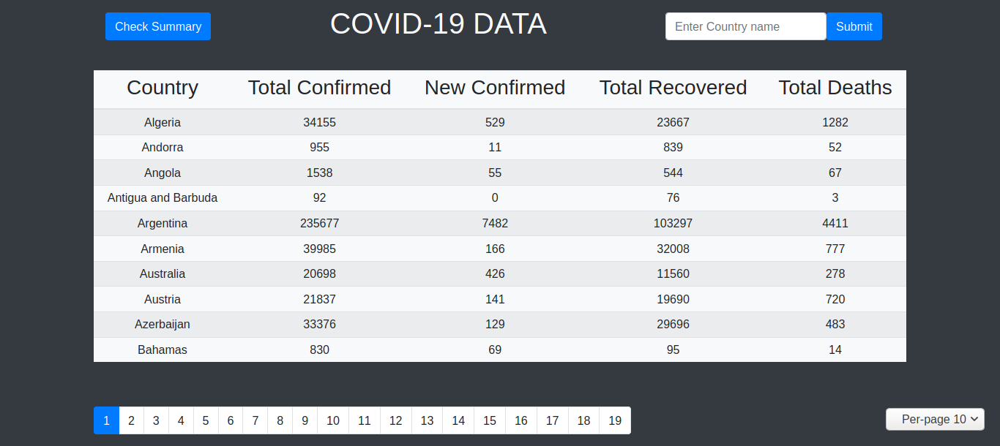
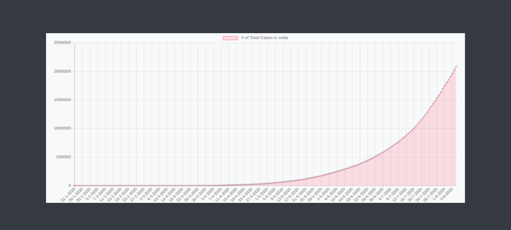
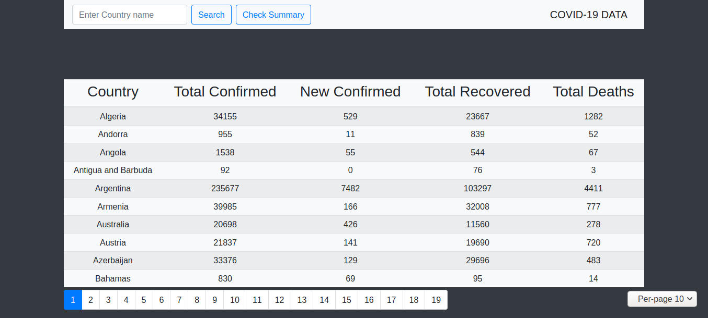
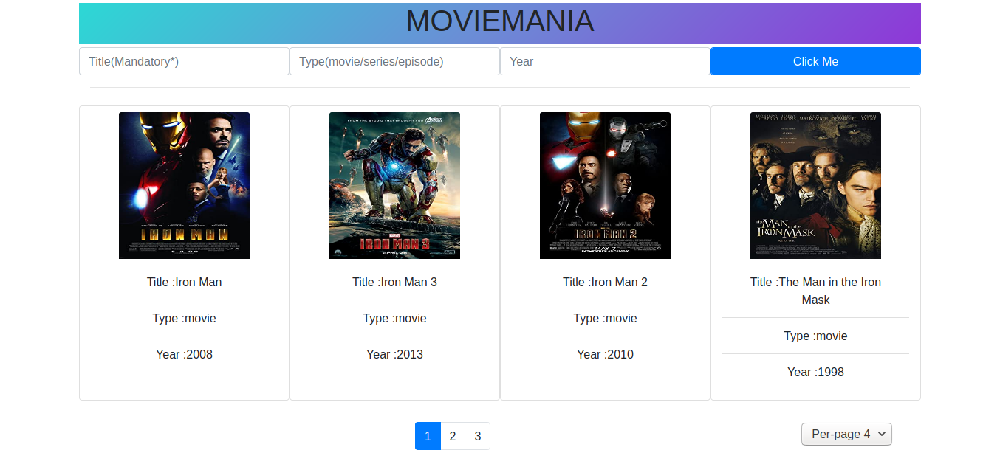
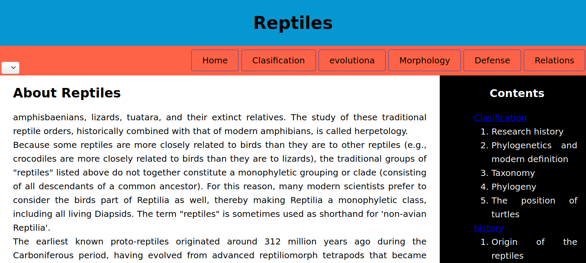
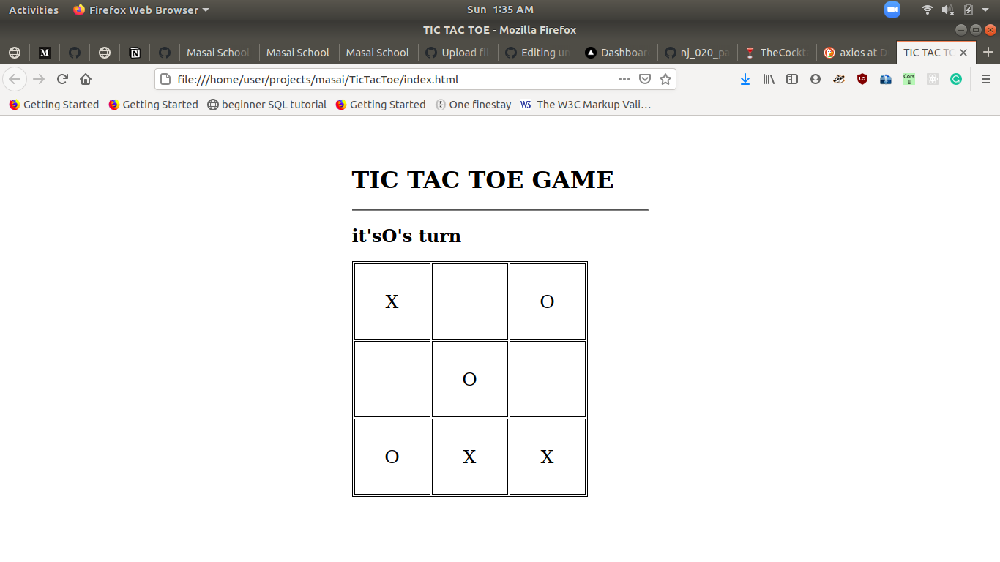
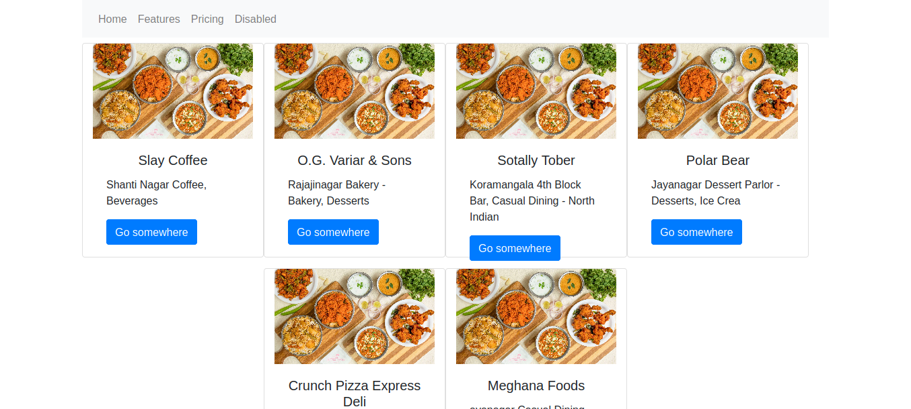
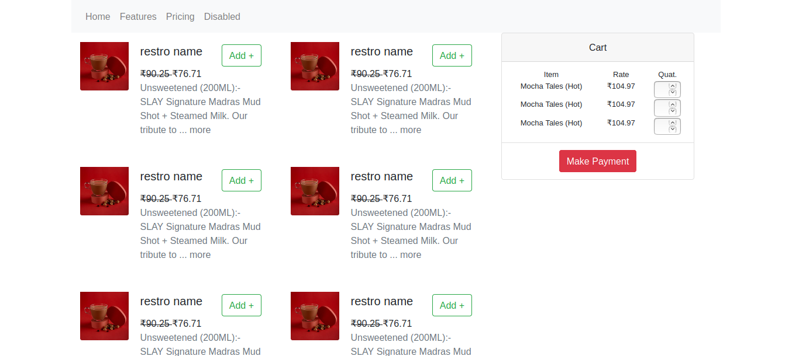

# Vanilla Javascript Projects

This repository houses a bunch of vanilla javascript projects, along with HTML and CSS. All these projects are deployed using github pages, the details about which can be found below and the links to projects in the respective headers.

* <h2><a href="https://pankaj-404.github.io/vanilla-projects/Covid-19/">Covid-19</a></h2>
Covid-19 is a web application that serves user with live Covid data. It fetches data from <a href="https://api.covid19api.com/">Covid19 API</a>, explores and manipulates the same. The user can check the country-wise summary, which consists of tabulated and paginated data of Total and New Confirmed, Total Recovered and Total Deaths. The user can also choose to view a detailed graph of number of cases based on any choice of country. The library called <a href="https://github.com/chartjs">Chart.js</a> was used, in order to represent the data using charts. Checkout the code <a href="https://github.com/pankaj-404/vanilla-projects/tree/master/Covid-19">here!</a>
 

* <h2><a href="https://pankaj-404.github.io/vanilla-projects/MovieMania/">Movie Mania</a></h2>
Movie Mania is a database of all the movies or series for the user to search and scroll through. It provides user with paginated data, allowing them to search via Title, Type or Year. The data is fetched from <a href="http://www.omdbapi.com/">OMDb API</a>, which is a RESTful web service to obtain movie information and other content. Checkout the code <a href="https://github.com/pankaj-404/vanilla-projects/tree/master/MovieMania">here!</a>
 

* <h2><a href="https://pankaj-404.github.io/vanilla-projects/OpenTriviaDB/">Open Trivia DB</a></h2>
Open Trivia DB provides user with categorized set of questions to test their knowledge against the chosen category. The user also has an option to select the number of questions. In the end of quiz, they are alerted with their score. The data is fetched from user-contributed <a href="https://opentdb.com/">trivia question database</a>. Checkout the code <a href="https://github.com/pankaj-404/vanilla-projects/tree/master/OpenTriviaDB">here!</a>
 

* <h2><a href="https://pankaj-404.github.io/vanilla-projects/Reptiles/">Reptiles</a></h2>
Reptiles web application brings all the information about Reptiles, including but not limited to classifications, morphology and defense mechanisms. The major purpose of this application is to exhibit the knowledge of HTML and styling with CSS. Checkout the code <a href="https://github.com/pankaj-404/vanilla-projects/tree/master/Reptiles">here!</a>
 

* <h2><a href="https://pankaj-404.github.io/vanilla-projects/TicTacToe/">TicTacToe</a></h2>
TicTacToe bring the game at user's disposal. The project exhibits the skills in Javascript and HTML. It is a two player game, where each player gets chance alternatively and the winner is alerted once game finishes. Checkout the code <a href="https://github.com/pankaj-404/vanilla-projects/tree/master/TicTacToe">here!</a>
 

* <h2><a href="https://pankaj-404.github.io/vanilla-projects/ZomatoClone/">ZomatoClone</a></h2>
ZomatoClone is a full-featured food ordering application, cloning Zomato features. The user can login to access all the features or register, if not a member. It provides user to surf through the restaurants and place an order. It also aims on achieving to become an Order Management System for admins. The admins can add or remove restaurants for starters. Checkout the code <a href="https://github.com/pankaj-404/vanilla-projects/tree/master/ZomatoClone">here!</a>
 

